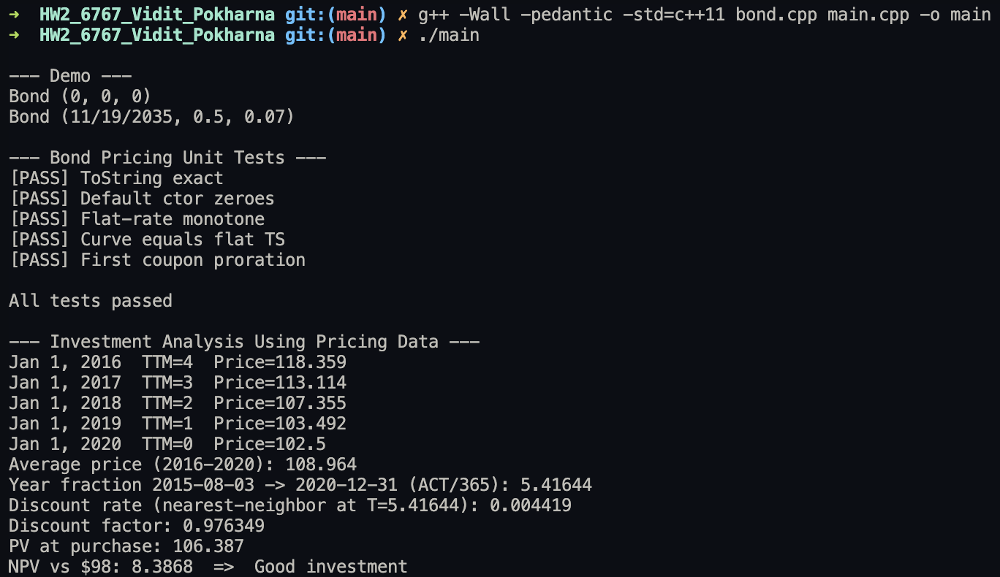

# HW2 - ISyE6767

## Files

* `bond.h` — Bond class declaration
* `bond.cpp` — Bond method implementations (incl. pricing)
* `main.cpp` — Task 1 demo prints, Task 2 unit tests, Task 3 analysis
* `Bond_Ex3.csv` — zero curve used in Task 3
* `report.pdf` — brief write-up

## What the Program Does

* Implements a Bond class with exact `ToString()` format
* Prices coupon bonds using continuous compounding with first-coupon proration
* Runs unit tests covering format, ctor zeros, monotonicity, curve==flat, proration
* Loads `Bond_Ex3.csv`, prices the underlying bond on Jan 1, 2016–2020 with TTM = {5,4,3,2,1}, averages the five prices, discounts the average back to Aug 3, 2015, and decides if the \$98 purchase was a good investment

### Key Classes / Functions

* `class Bond` (in `bond.h`/`bond.cpp`)
  * `ToString()`: returns `Bond (MM/DD/YYYY, 0.5, 0.07)` (spaces included)
  * `PriceFlat(r, T, tN, face=100)`: flat continuous zero rate
  * `Price(zTimes, zRates, T, tN, face=100)`: curve pricing with nearest-neighbor rate at each cash-flow time
* Helpers in `main.cpp`
  * CSV loader that detects `ttm` and `interest rate` columns
  * `yearfrac_act_365(...)` day-count
  * Small test helpers (`approx_equal`, `report`)

## How to Compile

Use a C++11 (or newer) compiler:

```bash
g++ -Wall -pedantic -std=c++11 bond.cpp main.cpp -o main
```

## How to Run

Place `Bond_Ex3.csv` next to the executable, then run:

```bash
./main
```

The output:

* Task 1 demo prints (two `Bond (...)` lines)
* Unit test results (PASS/FAIL)
* Task 3 table of five prices, average, discount details, PV, NPV, and conclusion

---

## Task 1 — Design & Implementation of the Bond Class

* Private members: `expiration_date_` (string), `frequency_` (double, years between coupons), `coupon_rate_` (double)
* Special members: default ctor (zeros), destructor, copy ctor, parameterized ctor
* Exact format: `ToString()` prints `Bond (MM/DD/YYYY, 0.5, 0.07)`; default prints `Bond (0, 0, 0)`

## Task 2 — Bond Pricing Function (+ Unit Tests)

* Model: present value $\text{Price}=\sum CF_i \cdot e^{-r(t_i)\,t_i}$
* Coupons: regular coupon $= \text{Face}\cdot \frac{\text{coupon\_rate}}{\text{payments per year}}$
* First coupon proration: multiply by $\frac{\text{time to next coupon}}{\text{time between coupons}}$
* APIs: `PriceFlat` (flat continuous rate) and `Price` (term structure, nearest-neighbor)
* Unit tests in `main.cpp`:
  * `ToString` exact match
  * default ctor zeros
  * price monotone vs. rate (3% > 5% > 7%)
  * flat curve ≈ flat rate
  * proration case (annual 5%, $t_N=0.25$, $r=0$ → 106.25)

## Task 3 — Investment Analysis Using Pricing Data

* Underlying: 10-year, 5% semiannual, face 100 (issued 2010-01-01)
* Observation dates: Jan 1 of 2016–2020 with TTM = 5,4,3,2,1, `tN = 0.5`
* Average payoff: arithmetic mean of the five prices
* Discount back: ACT/365 from 2015-08-03 to 2020-12-31 (≈ 5.41644 years) using nearest-neighbor zero rate from `Bond_Ex3.csv`
* Decision metric: $\text{NPV} = \text{PV(average)} - 98$ → program prints “Good/Bad investment”

## Code Output


