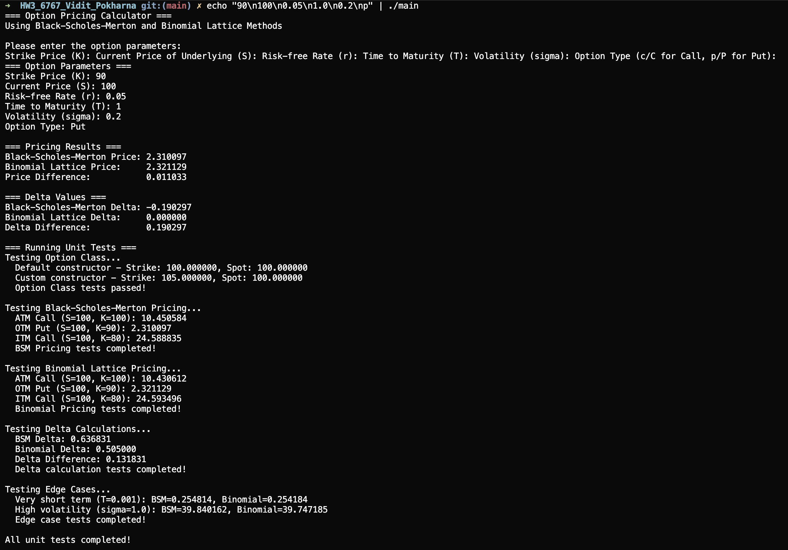

# HW3 - ISyE6767

## Files

* `Option.h` — option class declaration
* `Option.cpp` — option method implementations
* `pricing_method.h` — abstract pricing_method class declaration
* `Option_Price.h` — option_price class declaration (inherits from Option and Pricing_Method)
* `Option_Price.cpp` — option_price method implementations (BSM and Binomial pricing)
* `main.cpp` — user interface and main program
* `test.h` — unit testing suite
* `report.pdf` — brief write-up

## What the Program Does

* Implements an Option class with private init() method and all required parameters (K, S, r, T, σ)
* Creates an abstract Pricing_Method class with pure virtual BSM_Pricer() function
* Implements Option_Price class inheriting from both Option and Pricing_Method
* Prices European options using Black-Scholes-Merton analytical formula and Binomial Lattice method
* Calculates Delta values for both pricing methods
* Runs comprehensive unit tests covering various scenarios and edge cases
* Provides interactive user interface for option parameter input

### Key Classes / Functions

* `class Option` (in `Option.h`/`Option.cpp`)
  * Private `init()` method with default parameters
  * Parameters: Strike Price (K), Current Price (S), Risk-free Rate (r), Time to Maturity (T), Volatility (σ)
  * Default constructor and parameterized constructor
  * Getter methods for all parameters
* `class Pricing_Method` (in `pricing_method.h`)
  * Abstract class with pure virtual `BSM_Pricer()` and `Binomial_Pricer()` functions
  * Virtual destructor for proper inheritance
* `class Option_Price` (in `Option_Price.h`/`Option_Price.cpp`)
  * Inherits from both `Option` and `Pricing_Method`
  * Implements Black-Scholes-Merton pricing formula and Delta calculation
  * Implements Binomial Lattice pricing with 100 time steps and Delta calculation
  * Supports both call ('c'/'C') and put ('p'/'P') options
* Helpers in `test.h`
  * Unit tests for Option class constructors and getters
  * BSM and Binomial pricing tests with various scenarios
  * Delta calculation tests
  * Edge case testing (short maturity, high volatility)

## How to Compile

Use a C++11 (or newer) compiler:

```bash
g++ -o main main.cpp Option.cpp Option_Price.cpp -std=c++11 -lm
```

## How to Run

Run the executable:

```bash
./main
```

The output:

* Interactive prompts for option parameters (K, S, r, T, σ, option type)
* Option parameters summary
* Black-Scholes-Merton price and Delta
* Binomial Lattice price and Delta
* Price and Delta differences between methods
* Comprehensive unit test results

---

## Task 1 — Design & Implementation of the Option Class

* Private members: `K` (strike price), `S` (current price), `r` (risk-free rate), `T` (time to maturity), `σ` (volatility)
* Private method: `init()` to initialize with default parameters
* Special members: default ctor (calls init()), parameterized ctor, destructor
* Getter methods: `getStrikePrice()`, `getCurrentPrice()`, `getRiskFreeRate()`, `getTimeToMaturity()`, `getVolatility()`
* Default values: K=100, S=100, r=0.05, T=1.0, σ=0.2

## Task 2 — Design & Implementation of Pricing_Method Abstract Class

* Pure virtual functions: `BSM_Pricer()` and `Binomial_Pricer()`
* Virtual destructor for proper inheritance
* Abstract class design following object-oriented principles

## Task 3 — Design & Implementation of Option_Price Class

* Multiple inheritance from both `Option` and `Pricing_Method`
* Public member: `flag` for option type ('c'/'C' for call, 'p'/'P' for put)
* Implements Black-Scholes-Merton analytical pricing formula
* Implements Binomial Lattice method with 100 time steps
* Calculates Delta values for both methods
* Gets parameters from the `Option` class using getter methods

## Task 4 — Black-Scholes-Merton Implementation

* Standard BSM formula for European options: $C = S_0 N(d_1) - Ke^{-rT}N(d_2)$ for calls
* Put formula: $P = Ke^{-rT}N(-d_2) - S_0 N(-d_1)$
* Delta calculation: $\Delta = N(d_1)$ for calls, $\Delta = N(d_1) - 1$ for puts
* Uses numerical approximation for cumulative normal distribution

## Task 5 — Binomial Lattice Implementation

* 100 time steps for accurate approximation
* Up factor: $u = e^{\sigma\sqrt{\Delta t}}$, Down factor: $d = 1/u$
* Risk-neutral probability: $p = \frac{e^{r\Delta t} - d}{u - d}$
* Option price: $\sum_{j=0}^{n} \binom{n}{j} p^j (1-p)^{n-j} \max(S_0 u^j d^{n-j} - K, 0)$
* Delta calculated using finite difference approximation

## Code Output


